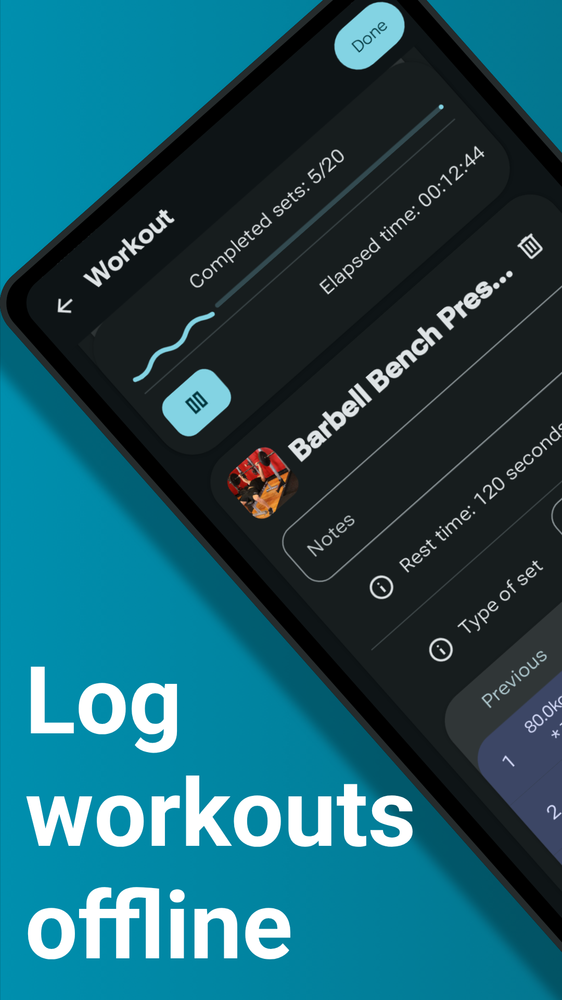
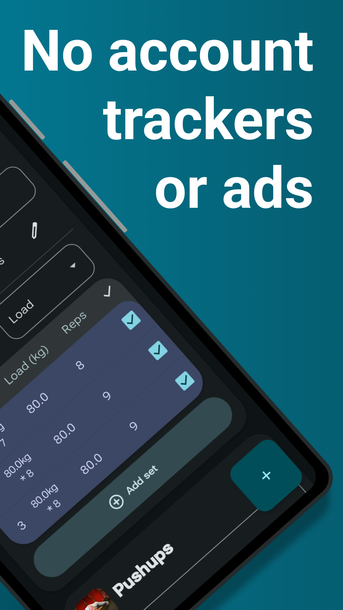
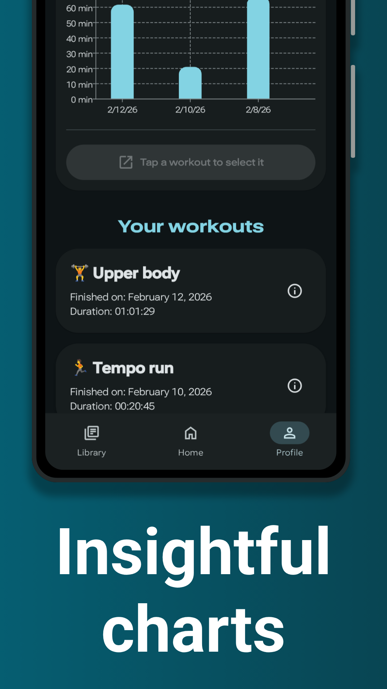
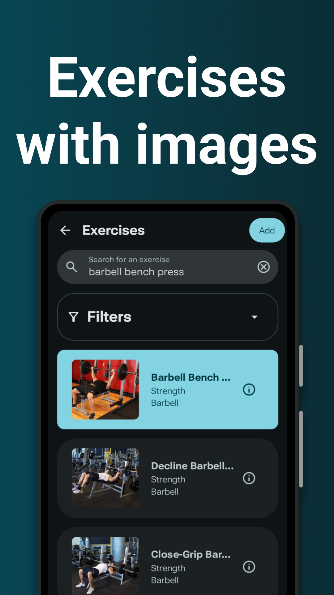
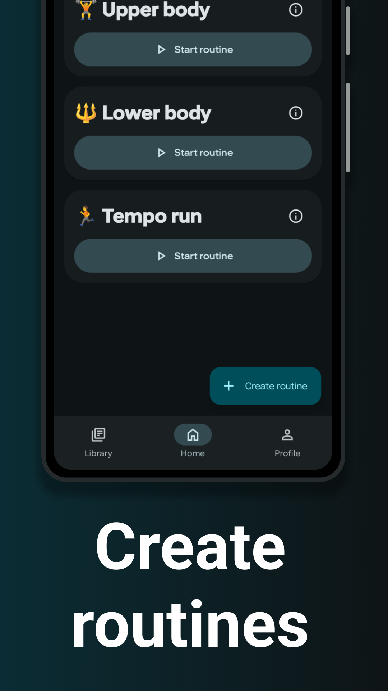

<div align="center">
    
</div>

# LibreFit - The free and private workout tracker

LibreFit is a free and open-source workout tracker designed with privacy in mind.

Create fully personalized workouts assembled from a rich dataset of hundreds of exercises — each
exercise paired with images and step-by-step instructions covering setup and execution.

Schedule single sessions, filter exercises by equipment, muscle group or difficulty with one tap.
During workouts, track every set, rep, rest interval, and load in real time.



## Table of Contents

- 🚀 [Features](README.md#-features)
- 🤝 [Let's Build LibreFit Together](README.md#-lets-build-librefit-together)
    - 💖 [Donating](README.md#-donate)
    - 🏗️ [Contributing to the source code](README.md#-contribute-to-source-code)
- ❓ [I Have A Question](README.md#-i-have-a-question)
- ⚡ [Building LibreFit from source](README.md#-building-librefit-from-source)
- 📜 [License](README.md#-license)
    - ™️ [Branding](README.md#-branding)
    - 📷 [Images of exercises](README.md#-images-of-exercises)
- 👥 [Credits](README.md#-credits)

## 🚀 Features

- 📊 **Activity Tracking**: Log your workouts with its exercises, sets, reps, and duration.
- 🎯 **Progress Monitoring**: Visualize your progress over time with insightful charts and
  statistics.
- 📅 **Workout Planning**: Create and customize workout plans tailored to your fitness goals.
- ✨️ **Rich dataset of exercises with images**: Access a comprehensive library of 800+ exercises
  with detailed instructions and demonstration images for proper form and technique.
- 📱 **Offline-First**: Track workouts and access all features without an internet connection.
- 🔒 **Privacy-Focused**: Your data is stored locally on your device, ensuring that your personal
  information remains private and secure.
- 🎨 **Material Design 3 Expressive**: Enjoy a sleek and modern user interface that enhances your
  experience.

## 🤝 Let's Build LibreFit Together

Thank you for considering improving LibreFit!

You can actively contribute to the project and become a **supporter** in one of the following ways:

- 💖 [Donating](README.md#-donate)
- 🏗️ [Contributing to the source code](README.md#-contribute-to-source-code)
- 🌐 [Translating](README.md#-translations)
- 🏋️ [Improving the exercise dataset](README.md#-improve-the-exercise-dataset)

Every **supporter** will be _credited_ in the about page of the app and in
[credits section](README.md#-credits), and it will be able to request the **supporter version** of
LibreFit
which includes:

- 📝 **Custom exercises**: The option to create and use custom exercises as they were in the dataset.
- 🎨 **Material You**: The app's theme will match the colors of system wallpaper.

> These features are either cosmetic or obtainable by giving back to the project but by no means
> this lowers the user experience

### 💖 Donate

Donations are the main way to:

- **Cover costs** (e.g. domain, paid plans for emails, etc.).
- **Thank and incentivize the creator** to invest more time in the project.

To donate, visit the [donation page](https://librefit.org/donate).

> [!IMPORTANT]
> If you wish the **supporter version**, ensure to donate
> using the **integrated processor** instead of direct on-chain transaction

### 🏗 Contribute to source code

See [Contributing to LibreFit](CONTRIBUTING.md)

### 🌐 Translations

*Coming soon...* 🚧

### 🏋 Improve the exercise dataset

*Coming soon...* 🚧

## ❓ I Have a Question

Before you ask a question, it is best to search for
existing [Discussions](https://github.com/LibreFitOrg/LibreFit/discussions)
and [Issues](https://github.com/LibreFitOrg/LibreFit/issues) that might help you.

If you then still feel the need to ask a question and need clarification, we recommend the
following:

- Open a [Discussion](https://github.com/LibreFitOrg/LibreFit/discussions/new).
- Provide as much context as you can about what you're running into.
- Provide project and platform versions, depending on what seems relevant.

We will then take care of the question as soon as possible.

## ⚡ Building LibreFit from source

1. **Clone** the project locally (or download source code as `.zip` file):
    ```bash
    git clone https://github.com/LibreFitOrg/LibreFit.git
    ```
2. **Open in Android Studio:**  Open Android Studio and select _"Open an existing Android Studio
   project"_, pointing to the cloned/downloaded directory.
3. **Sync Gradle:** Let Android Studio download the dependencies and sync the project.
4. **Build the app**: Connect a device or start an emulator and run `Run 'app'` in Android Studio
   or:
    ```bash
    ./gradlew assembleDebug
    ```
   
> [!NOTE]
> This project supports [reproducible builds](https://reproducible-builds.org/). See [REPRODUCIBLE.md](REPRODUCIBLE.md)

## 📜 License

LibreFit is licensed under the [GNU General Public License v3.0 (GPL-3)](COPYING), and it is subject
to these [additional terms](ADDITIONAL_TERMS.md).

In short, this means you are free to use, modify, and distribute the code, but you must:

- **Share your changes**: If you distribute a modified version, you must also license it under the
  GPLv3.
- **Give credit:** Keep the original copyright notice and attribute the original work to LibreFit.
- **Mark your changes:** Clearly indicate that your version is a modification of the original.
- **Do not use the brand:** You cannot use the name "LibreFit" or its logo to promote your modified
  version.

### ™️ Branding

The "LibreFit" name and logos are trademarks. **All Rights Reserved**.

Their use is governed by the [Trademark Policy](TRADEMARK_POLICY.md) which applies to relevant files located in
`assets` and `app/src/main/res`.

### 📷 Images of exercises

> [!CAUTION]
> Due to the nature of AI generation, these images may contain inaccuracies and/or artifacts.
> **They are provided "as is" without any warranty**.

Images in `app/src/main/assets` are AI generated therefore they are **not subject to copyright** and are **provided without restriction**.

They are continuously reviewed and regenerated in order to improve their quality.

## 👥 Credits

Thanks to everyone who helped the project!

### 💖 Donators

[Donate](README.md#-donate) to be the **first** person listed.

### 🏗 Contributors

[Contribute to source code](CONTRIBUTING.md) to be the **first** person listed.

---

Made with ❤️ by [IamDg](https://github.com/IamDg)