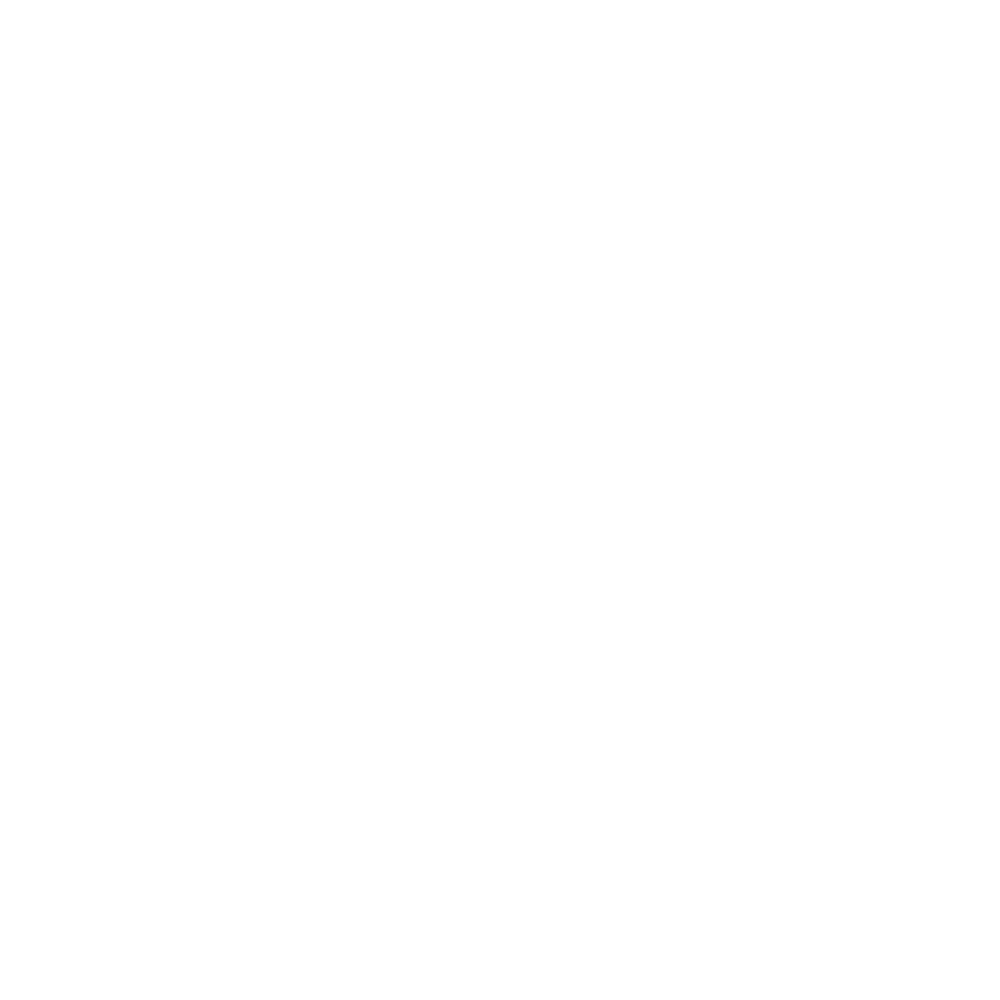

<div align="center">



# Nexc

### Private · Minimalist · Offline Workout Tracker

[](https://flutter.dev)
[](COPYING)
[](https://github.com/LibreFitOrg/LibreFit)

</div>

---

> **Nexc is a hard fork of [LibreFit](https://github.com/LibreFitOrg/LibreFit)** by [LibreFitOrg](https://github.com/LibreFitOrg).
> LibreFit provided the exercise database, data model, and original Android foundation that made this project possible.
> Without their work, Nexc would not exist. All original code remains under the GNU GPL v3.

---

## Features

- **Workout Tracking**: Log routines, supersets, exercises, customizable set types (warmup, working, drop set, failure), RPE/RIR values, reorder routines, and custom sorting.
- **Rest Timer with Live Notifications**: Pentagonal timer, lock screen, dynamic floating notifications with real-time remaining progress bars.
- **Sleep & Health Tracking**: Advanced sleep log (longest awake time, duration input in hours/minutes, sleep phases) and body measurements (weight, body fat %, muscle mass %, height).
- **Meal Logs & Macro Goals**: Add products, log meals, track macros (calories, proteins, carbs, fats), import/export meal plans with strict data validation, and override macros dynamically.
- **Clean Modern Interface**: Material 3 styling, theme-aware layouts, sticky workout status bars, interactive widgets.
- **Backup & Restore**: Easily export and import database or individual routines, recipes, and plans.
- **Offline & Private**: 100% offline, local database, no tracking, complete privacy.

The active app is now a Flutter project targeting Android and iOS from a single codebase. The original Android codebase lives in [`legacy/nexc_android/`](legacy/nexc_android/) and is kept intact as a historical reference and tribute to LibreFit's architecture.

---

## Build (Flutter)

### Prerequisites

- Flutter 3.x (`flutter --version`)
- Android SDK 35+ **or** Xcode 15+ for iOS

### Getting Started

```bash
git clone https://github.com/nzzrs/nexc.git
cd nexc
flutter pub get
flutter run
```

### Run tests

```bash
flutter test
```

---

## Project structure

```
/                        # Flutter project root
├── lib/                 # Dart source
│   ├── core/            # DB, providers, theme, shared components
│   └── features/        # Screens: workout, meals, exercises, profile…
├── android/             # Flutter Android host
├── ios/                 # Flutter iOS host
├── assets/              # Fonts, images, icons
├── legacy/
│   └── nexc_android/    # Original Kotlin/Jetpack Compose app (LibreFit fork)
└── docs/                # Additional documentation
```

---

## License & Attribution

Nexc is distributed under the **GNU General Public License v3.0** — the same license as LibreFit.

Full license text: [COPYING](COPYING)

### Credits

| Project | Authors | Role |
|---------|---------|------|
| [LibreFit](https://github.com/LibreFitOrg/LibreFit) | [LibreFitOrg](https://github.com/LibreFitOrg) & contributors | Original codebase, exercise DB, data model — the foundation of Nexc |

See [CONTRIBUTING.md](CONTRIBUTING.md) and [CODE_OF_CONDUCT.md](CODE_OF_CONDUCT.md) for original upstream guidelines.

---

<div align="center">
Built on the shoulders of <a href="https://github.com/LibreFitOrg/LibreFit">LibreFit</a>. Made for the fitness community.
</div>
