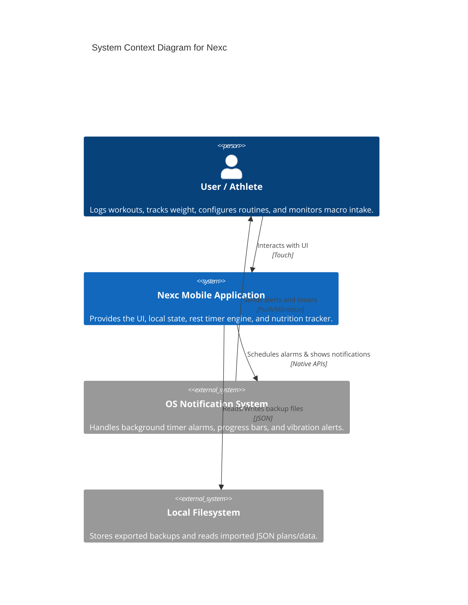
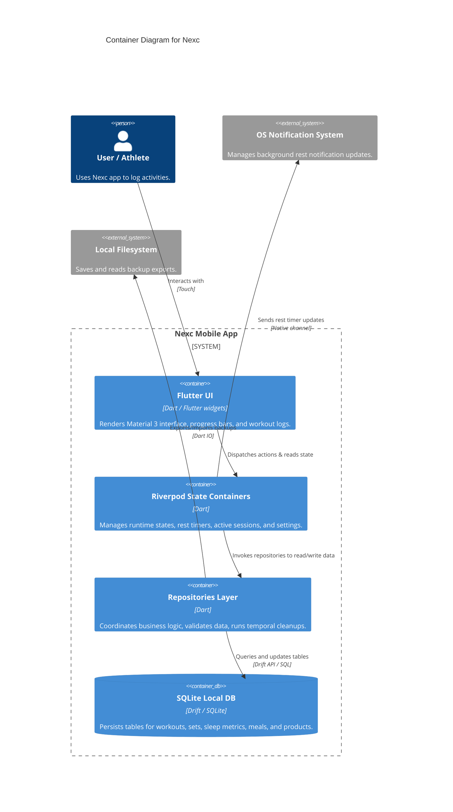
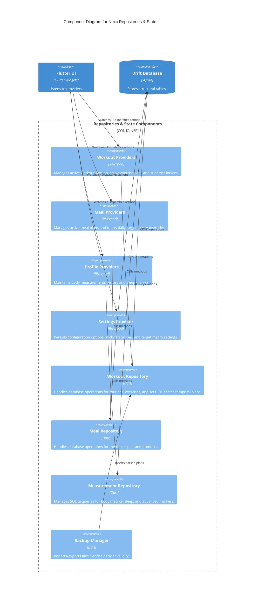
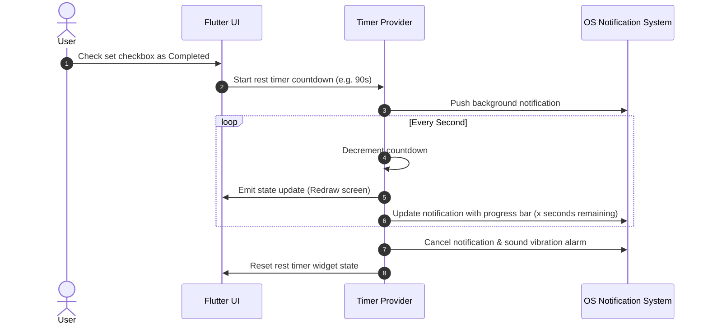
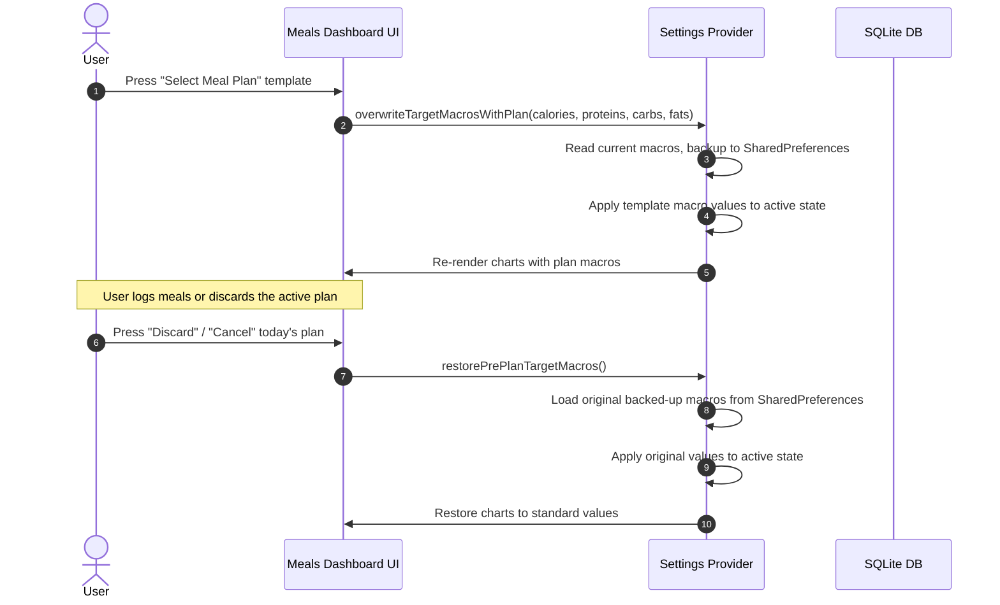

# Nexc - Architecture Documentation (arc42 & C4 Model)

This document describes the software architecture of **Nexc**, a private, minimalist, offline-first workout and nutrition tracker built using Flutter.

---

## 1. Introduction and Goals

Nexc is designed to allow fitness enthusiasts to plan and log workouts, track sleep, log body measurements, and calculate daily nutritional intake (macro tracking) with zero cloud reliance. Complete privacy and offline speed are the core pillars.

### Quality Goals

1. **Complete Privacy (100% Offline-First)**: No user data is transmitted to remote servers. All computation, storage, and notification management happen locally on the user's device.
2. **High Responsiveness**: Interface rendering, set logging, rest timer countdown, and search operations must execute instantly without network latency or blocking frames.
3. **Visual Polish (Material 3)**: A beautiful, modern user experience including custom animations (e.g., rotating pentagonal rest timer, wavy circular progress bars, summary page).
4. **Data Integrity & Robustness**: Backup files (JSON-based imports/exports) must validate strictly before modifying the database.

---

## 2. Architecture Constraints

- **Cross-Platform Target**: Must build and run on both Android (SDK 21+) and iOS (iOS 12.0+) using a single Flutter codebase.
- **Local Persistence Engine**: Must use a relational SQLite engine via Drift (Dart persistence library) to enforce referential integrity across complex relations (e.g., workouts to exercises, and sets).
- **Background Limitations**: Android and iOS strict background task constraints apply to the rest timer notifications. System battery optimization overrides are requested to prevent execution throttling.

---

## 3. System Scope and Context

Nexc is self-contained. It interacts only with the local operating system APIs (for local storage, notification managers, and battery optimizations) and the user's filesystem for importing/exporting backup files.

### C4 Level 1: System Context Diagram



---

## 4. Solution Strategy

1. **State Management (Riverpod)**: Unidirectional data flow. UI elements listen to logic providers and rebuild reactively. Side effects (database writes, timer updates) trigger state mutations.
2. **Repository Pattern**: Domain logic is separated from Drift database queries. Repository classes (`WorkoutRepository`, `MealRepository`, `DatasetRepository`) act as single sources of truth.
3. **Strict Validation layer**: Importers check structural correctness of incoming products, routines, and recipes, generating meaningful warnings instead of populating missing components with empty/dummy values.

---

## 5. Building Block View

### C4 Level 2: Container Diagram



### C4 Level 3: Component Diagram (Core Business Logic)



---

## 6. Runtime View

### Rest Timer Lifecycle & Notification updates

The rest timer initiates when a user completes a set. To prevent the operating system from terminating the timer service in the background, a native notification service updates the progress periodically.



### Macro Goal Overrides on Meal Plan Selection

When a user selects a template meal plan, the daily target macro goals are temporarily overwritten by the plan's custom goals.



---

## 7. Deployment View

Nexc is distributed as a single standalone executable package (.apk for Android, .ipa for iOS).

```
+-------------------------------------------------------------+
|                     User Mobile Device                      |
|                                                             |
| +---------------------------------------------------------+ |
| |                    Nexc Application                     | |
| |                                                         | |
| |  +--------------------+       +----------------------+  | |
| |  | Flutter UI Engine  | ====> | Dart / Riverpod VM   |  | |
| |  +--------------------+       +----------------------+  | |
| +---------------------------------------------------------+ |
|                                |                            |
|                                v (SQLite Native API)        |
| +---------------------------------------------------------+ |
| |               Private Sandbox File System               | |
| |                                                             | |
| |   [nexc_db.sqlite]  -  Local DB File                      | |
| |   [settings.pref]   -  SharedPreferences                  | |
| +---------------------------------------------------------+ |
+-------------------------------------------------------------+
```

---

## 8. Crosscutting Concepts

### Offline Data Synchronization
Since there is no server-side coordination, all sync actions are user-triggered via file transfer. The JSON import mechanism acts as an idempotent database synchronizer, checking for record existence by UUID (or custom keys) before insertion to avoid duplicates.

### Temporal Plan Cleanups
To avoid clogging the local database with discarded or single-use plans, an automatic cleanup logic is triggered on app launch.
- Records in `WorkoutPlans` or `MealPlans` marked with `isTemporal = true` are deleted if they were created more than 12 hours ago.
- Logged events (`Workouts` and completed `Meals` tables) are preserved entirely.

---

## 9. Architectural Decisions

- **Drift (Relational Database)**: Selected over NoSQL local databases (e.g., Hive or Isar) because workout routines require strict structural links (Workout -> Exercise -> Sets). cascade deletes and relational constraints are natively handled by SQLite.
- **Unidirectional Riverpod Flow**: State notifier models prevent side-effect pollution in the UI. If a set is completed, logic goes through `ref.read()`, database writes, and reactive state updates.

---

## 10. Quality Requirements

| Quality Category | Metric / Scenario | Mitigation |
|------------------|-------------------|------------|
| **Privacy** | Zero internet calls. | Internet permission is not declared in native manifests unless debug mode requires it. |
| **Performance** | Screen load < 100ms. | Drift database queries utilize proper indices on foreign keys (`workout_id`, `meal_plan_id`). |
| **Usability** | Clear timer view even in background. | Custom notification channel with progress bar implementation. |

---

## 11. Risks and Technical Debt

1. **Operating System Battery Throttling**: Android (OEM-specific battery savers) and iOS (Background Tasks API limit) can freeze Dart VM timer loops. Calling a request for battery optimization exemption is implemented to mitigate this risk.
2. **Schema Migration Complexity**: If tables change (e.g. adding new sleep parameters), database version upgrades must declare schema migration paths in `app_database.dart` to prevent data loss.

---

## 12. Glossary

- **WorkoutPlan (Routine)**: A predefined template of exercises and sets that can be executed repeatedly.
- **Workout (Log)**: A specific instance of a logged routine with timestamps, completed repetitions, and weights.
- **MealPlan**: A nutritional template defining daily meal targets and macro-nutrient configurations.
- **isTemporal**: A flag indicating that a plan or routine is temporary and will be purged 12 hours after creation.
